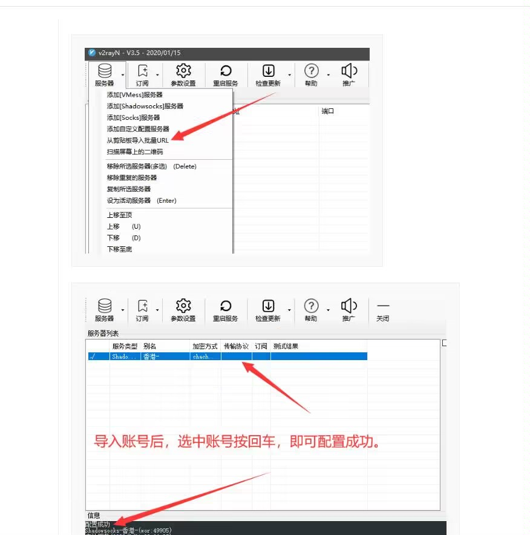
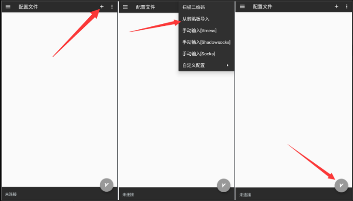

# 学习过程

# ======================================================================================================
# 2026-1-5
# 1.安装GPU的AI环境
你提供的图片内容是终端输出的命令结果，我来为你 逐行分析并解读，帮助你理解当前环境状态和问题所在。

✅ 1. conda info --envs 输出（Conda 环境列表）
conda environments:
base D:\ProgramData\anaconda3
labeling D:\ProgramData\anaconda3\envs\labeling
pro_python_env D:\ProgramData\anaconda3\envs\pro_python_env
yolov8_gpu D:\ProgramData\anaconda3\envs\yolov8_gpu
🔍 分析：
当前激活的环境是：✅ yolov8_gpu（星号 表示激活）
其他环境：
base：Anaconda 默认环境
labeling、pro_python_env：可能是其他项目用的
✅ 说明你在正确的环境中运行命令！

❌ 2. python -c "import torch; print(torch.__version__, torch.cuda.is_available())" 输出

2.9.1+cpu False
🔍 严重问题！这说明：

项目 结果 问题
------ ------ ------
PyTorch 版本 2.9.1+cpu 安装的是 CPU 版本！
CUDA 可用 False GPU 无法使用
⚠️ 虽然你之前说安装了 cu121，但实际安装的是 CPU 版本。
这就是为什么 torch.cuda.is_available() 返回 False。

📌 根本原因：你安装了错误的 PyTorch 包

即使你在 yolov8_gpu 环境中运行了：
bash
pip install torch torchvision torchaudio --index-url https://download.pytorch.org/whl/cu121

但可能因为以下原因之一失败了：

1. Python 版本不兼容（虽然你是 3.11，但有时包索引未更新）
2. 网络问题导致下载了 CPU 版
3. pip 缓存或镜像源干扰
4. 手动安装时没有正确指定 URL

✅ 解决方案：重新安装 CUDA 版 PyTorch
步骤 1：卸载当前所有 torch 相关包

powershell
pip uninstall torch torchvision torchaudio -y
步骤 2：清除 pip 缓存（可选，防止旧包干扰）

powershell
pip cache purge
步骤 3：从官方源重新安装 CUDA 12.1 版本

powershell
pip install torch torchvision torchaudio --index-url https://download.pytorch.org/whl/cu121
💡 注意：一定要使用完整 URL，不能只写 --index-url https://download.pytorch.org/whl/cu121 后面跟空格。
步骤 4：验证是否成功

powershell
python -c "import torch; print(torch.__version__, torch.cuda.is_available(), torch.version.cuda)"

✅ 预期输出：

2.5.1+cu121 True 12.1
如果看到 +cu121 和 True，说明 GPU 已启用！

🧪 补充检查：确认安装的是哪个版本

你可以查看已安装的包：

powershell
pip list findstr torch

应该看到：

torch 2.5.1+cu121
torchaudio 2.5.1+cu121
torchvision 0.20.1+cu121
❌ 如果还是显示 +cpu，说明安装失败。

🔍 为什么会出现这种情况？

1. PyTorch 官方 wheel 包命名规则：
+cpu → CPU 版
+cu121 → CUDA 12.1 版
+cu118 → CUDA 11.8 版

2. 如果 pip install 时 URL 不对或网络超时，可能会自动回退到 CPU 版。

3. 某些代理或镜像源（如清华、豆瓣）不提供 CUDA 版本，只会给 CPU 版。

✅ 最终建议

1. 不要使用国内镜像源（除非你知道它支持 CUDA）。
2. 直接使用官方源：
bash
pip install torch torchvision torchaudio --index-url https://download.pytorch.org/whl/cu121

3. 确保网络稳定，避免中断。
4. 安装后立即验证，不要依赖 pip list 的名称。

🚀 总结

项目 状态 建议
------ ------ ------
Conda 环境 ✅ yolov8_gpu 已激活 正确
PyTorch 版本 ❌ 2.9.1+cpu 必须重装 CUDA 版
CUDA 支持 ❌ False 重装后应为 True
✅ 请按照上述步骤重新安装 CUDA 版 PyTorch，然后再次验证。

完成后，你的 RTX 4060 Ti 就能正常用于 YOLO 训练了！

需要我帮你写一个完整的安装脚本吗？

# ======================================================================================================
# 2026-1-5
# 2.使用通俗易懂的语言解释：torch，torchaudio，torchvision
当然可以！我们用通俗易懂的大白话来解释这三行内容：

📦 这三行是说你电脑里安装了三个“工具包”，它们都属于 PyTorch（一个做人工智能/深度学习的软件）：

工具包名 版本号 作用
-------- -------- ------
torch 2.5.1+cu121 核心大脑：负责所有计算，比如训练模型、处理数据
torchaudio 2.5.1+cu121 音频小助手：专门处理声音、语音（比如识别说话内容）
torchvision 0.20.1+cu121 图像小助手：专门处理图片、视频（比如识别猫狗、人脸）

🔑 关键点：+cu121 是什么意思？
cu121 = CUDA 12.1
CUDA 是 NVIDIA 显卡的加速技术
所以 +cu121 表示：
✅ 这些工具包支持你的 RTX 4060 Ti 显卡，能用 GPU 加速计算，速度比 CPU 快几十倍！
💡 如果看到的是 +cpu，那就只能用 CPU 算，非常慢。

✅ 总结成一句话：
你已经成功安装了 支持显卡加速（GPU）的 PyTorch 及其图像、音频处理工具，版本匹配，可以放心用来训练 YOLO 模型！

就像你给汽车装上了高性能发动机（GPU），而不是只靠人力推车（CPU）🚗💨

🔍 小贴士：
虽然 torchvision 的版本是 0.20.1，而 torch 是 2.5.1，看起来数字不一致，但这是正常的——它们是不同团队维护的，只要都是 +cu121，就能一起工作！

如果想升级到完全匹配的版本，也可以运行：
bash
pip install --upgrade torchvision

但不是必须的，目前完全可以正常使用。

# ======================================================================================================
# 2026-1-5
# 3.如果下载速度很慢，建议使用清华镜像源，命令如下：
pip install torch torchvision torchaudio --index-url https://download.pytorch.org/whl/cu121
# 如果仍然很慢，建议使用豆瓣镜像源：
pip install torch torchvision torchaudio --index-url https://pypi.doubanio.com/simple
# 如果仍然很慢，建议使用官方源：
pip install torch torchvision torchaudio --index-url https://download.pytorch.org/whl/cu121
# 如果官方源仍然很慢，建议购买一个好的网络连接，或者使用代理工具。
# 购买链接 
【淘宝】http://e.tb.cn/h.TYeDe38i6pFgdYp?tk=3kpE3IU30FL CZ0002 「云电脑远程服务器高主频性能挂QQYY千牛机器人E5虚拟主机出租」点击链接直接打开 或者 淘宝搜索直接打开
# 一年费用：295元

# 一年的使用期期的vmess内容：
vmess://ew0KICAidiI6ICIyIiwNCiAgInBzIjogIue+juWbvS0yMDI3LjEuNSIsDQogICJhZGQiOiAiZGF0YTE1Lm0xbmVpNm5ldC5jb20iLA0KICAicG9ydCI6ICI2NDY4IiwNCiAgImlkIjogIjI5NTliZDQ5LTVjYzgtNGQ3YS05ZTBlLTU1NDExMTVjOTVhYSIsDQogICJhaWQiOiAiMCIsDQogICJzY3kiOiAiYXV0byIsDQogICJuZXQiOiAidGNwIiwNCiAgInR5cGUiOiAibm9uZSIsDQogICJob3N0IjogIiIsDQogICJwYXRoIjogIiIsDQogICJ0bHMiOiAibm9uZSIsDQogICJzbmkiOiAiIiwNCiAgImFscG4iOiAiIg0KfQ==

# PC 怎么导入vmess内容？

# mobile 怎么导入vmess内容？
# 下载，安装
# 教程与软件：http://yun246.xyz （复制到浏览器打开）

# 配置
