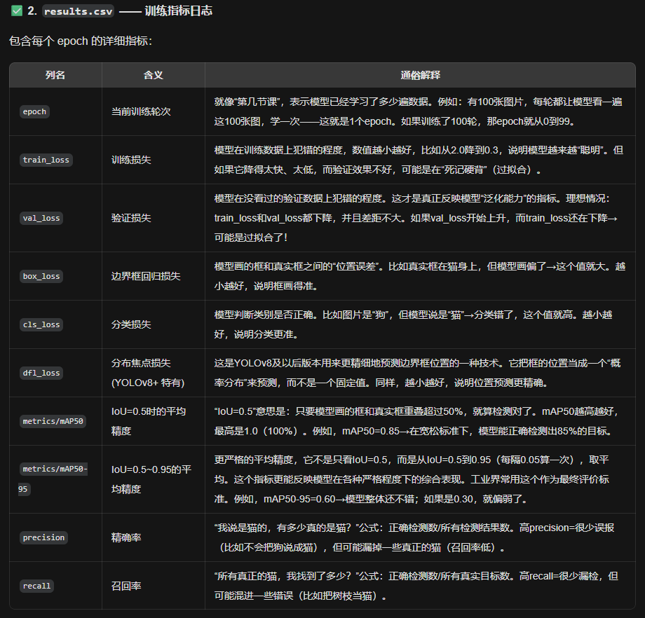
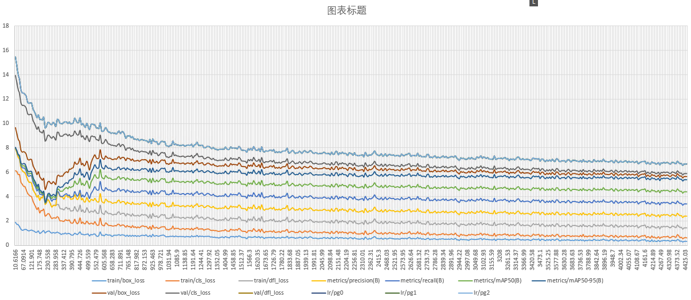
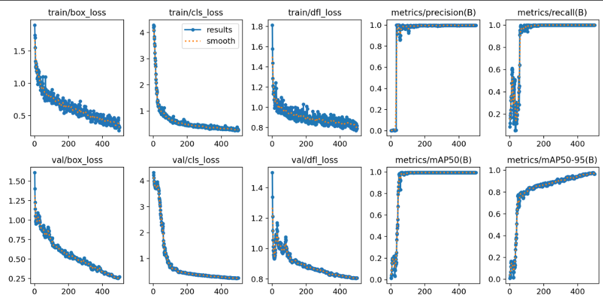

# 学习过程

# ======================================================================================================
# 2025-12-24

1. 环境安装
（1）功能包
    import streamlit as st  # 导入Streamlit库，用于创建Web应用界面
    from ultralytics import YOLO  # 导入YOLO模型库，用于目标检测
    import cv2  # 导入OpenCV库，用于图像和视频处理
    import numpy as np  # 导入NumPy库，用于数值计算
    from PIL import Image  # 导入PIL库，用于图像处理
    import tempfile  # 导入临时文件库，用于处理上传的文件
    import os  # 导入os库，用于操作系统相关功能（如路径操作）

    说明：在PyCharm的调试界面，输入下面的指令可以将工具包安装到指定的目录下。
        pip install streamlit --target D:\anaconda3\Lib\site-packages -i https://mirrors.aliyun.com/pypi/simple/
    有时候需要制定以下工具包下载工具的目录，才能正常下载，如：
        D:\anaconda3\Scripts\pip.exe install pyautogui --target D:\anaconda3\Lib\site-packages -i https://mirrors.aliyun.com/pypi/simple/

# -----------------------------------------------------------------------------------------------------
(2)YOLO：
    名称：Ultralytics | 彻底改变视觉人工智能世界
    官网：https://www.ultralytics.com/zh
    模型下载：https://github.com/ultralytics/ultralytics
    学习视频：
        名称：2025最新YOLO目标检测训练/开发教程（Python 人工智能Ai视觉模型）
        URL：https://www.bilibili.com/video/BV1XECzYLECa?spm_id_from=333.788.videopod.episodes&vd_source=81955c763bc62ab44ed6bea12a070b41&p=5

# -----------------------------------------------------------------------------------------------------
（2）启动 streamlit
    说明：让用户可以在web上调试。

    方式1：在Pycharm中启动 streamlit
        运行/调试配置 
        module=streamlit 
        运行参数=run "D:/PythonProject/pro_python/pro_debug/test5/Car-Plate-Detection-YOLO-main/Streamlit app/app.py"
        工作目录=D:/PythonProject/pro_python/pro_debug/test5/Car-Plate-Detection-YOLO-main/Streamlit app
        环境变量=PYTHONUNBUFFERED=1
    
    方式2：PowerShell上启动
        PS D:\anaconda3\Lib\site-packages> cd D:\anaconda3\Lib\site-packages\streamlit
        PS D:\anaconda3\Lib\site-packages\streamlit> cd D:\anaconda3\Scripts
        PS D:\anaconda3\Scripts> D:\anaconda3\Scripts\streamlit.exe run "D:/PythonProject/pro_python/pro_debug/test5/Car-Plate-Detection-YOLO-main/Streamlit app/app.py"
        执行之后，窗口上显示如下内容，表示成功。
        
          You can now view your Streamlit app in your browser.
        
          Local URL: http://localhost:8501
          Network URL: http://10.114.231.139:8501

# -----------------------------------------------------------------------------------------------------
3. 加载官方模型和图片

# -----------------------------------------------------------------------------------------------------
4. 标识自己的对象，然后加载官方模型，进行训练

# ======================================================================================================
# 2025-12-25

 YOLO 训练完成后在 train/ 目录下生成的输出文件和可视化结果，这些文件由 Ultralytics YOLO（如 YOLOv5、YOLOv8）
 训练脚本自动保存。下面我来逐个解释它们的含义：

train/
├── weights/              # 模型权重文件
│   ├── best.pt           # 最优模型（验证集上 mAP 最高）
│   ├── last.pt           # 最后一个 epoch 的模型
│   └── args.yaml         # 训练时的参数配置
├── results.csv           # 训练日志数据（CSV 格式）
├── results.png           # 综合训练曲线图
├── confusion_matrix.png  # 混淆矩阵（分类错误分析）
├── BoxP_curve.png        # 精度-召回率曲线（PR 曲线） for boxes
├── BoxPR_curve.png       # Precision-Recall curve (for detection)
├── BoxR_curve.png        # Recall curve
└── train_batch*.jpg      # 训练过程中的样本可视化
    └── val_batch*.jpg    # 验证集样本可视化

# -----------------------------------------------------------------------------------------------------

🔍 各文件详解
✅ 1. weights/ 文件夹 —— 模型权重
best.pt：训练过程中，在验证集上表现最好的模型（通常 mAP 最高），推荐用于推理。
last.pt：最后一个 epoch 的模型，可能过拟合或未收敛。
args.yaml：记录了训练时使用的参数（如 epochs、batch_size、lr 等），可用于复现实验。
💡 建议使用 best.pt 进行推理部署。

# -----------------------------------------------------------------------------------------------------

✅ 2. results.csv —— 训练指标日志
包含每个 epoch 的详细指标：
图示：

# -----------------------------------------------------------------------------------------------------

👉 可用 Excel 或 Pandas 打开，画出训练曲线。

# -----------------------------------------------------------------------------------------------------

👉 这里是数据的通俗易懂的说明
列名	含义
epoch	当前训练轮次
train_loss	训练损失
val_loss	验证损失
box_loss, cls_loss, dfl_loss	分别对应边界框回归、分类、分布焦点损失
metrics/mAP50, mAP50-95	检测精度（IoU=0.5 和 IoU=0.5~0.95）
precision, recall	分类准确率与召回率

# -----------------------------------------------------------------------------------------------------

📌 1. epoch（轮次）
就像“第几节课”。
比如你有 100 张图片，每轮都让模型看一遍这 100 张图，学一次——这就是 1 个 epoch。
如果训练了 100 轮，那 epoch 就从 0 到 99。
# -----------------------------------------------------------------------------------------------------
📌 2. train_loss（训练损失）
衡量模型在训练数据上犯错的程度。
数值越小越好，比如从 2.0 降到 0.3，说明模型越来越“聪明”。
但如果它降得太快、太低，而验证效果不好，可能是在“死记硬背”（过拟合）。
# -----------------------------------------------------------------------------------------------------
📌 3. val_loss（验证损失）
衡量模型在没看过的验证数据上犯错的程度。
这才是真正反映模型“泛化能力”的指标。
理想情况：train_loss 和 val_loss 都下降，并且差距不大。
如果 val_loss 开始上升，而 train_loss 还在下降 → 可能过拟合了！
# -----------------------------------------------------------------------------------------------------
📌 4. box_loss（边界框损失）
模型画的框和真实框之间的“位置误差”。
比如真实框在猫身上，但模型画偏了 → 这个值就大。
越小越好，说明框画得准。
# -----------------------------------------------------------------------------------------------------
📌 5. cls_loss（分类损失）
模型判断类别是否正确。
比如图片是“狗”，但模型说是“猫” → 分类错了，这个值就高。
越小越好，说明分类更准。
# -----------------------------------------------------------------------------------------------------
📌 6. dfl_loss（分布焦点损失，YOLOv8+ 特有）
这是 YOLOv8 及以后版本用来更精细地预测边界框位置的一种技术。
它把框的位置当成一个“概率分布”来预测，而不是一个固定值。
同样，越小越好，说明位置预测更精确。
💡 你可以把它理解为“高级版的 box_loss”。
# -----------------------------------------------------------------------------------------------------
📌 7. metrics/mAP50
mAP50 = 平均精度（IoU 阈值为 0.5）
“IoU=0.5” 意思是：只要模型画的框和真实框重叠超过 50%，就算检测对了。
mAP50 越高越好，最高是 1.0（100%）。
比如 mAP50 = 0.85 → 在宽松标准下，模型能正确检测出 85% 的目标。
# -----------------------------------------------------------------------------------------------------
📌 8. metrics/mAP50-95
更严格的平均精度，它不是只看 IoU=0.5，而是从 IoU=0.5 到 0.95（每隔 0.05 算一次），取平均。
这个指标更能反映模型在各种严格程度下的综合表现。
工业界常用这个作为最终评价标准。
比如 mAP50-95 = 0.60 → 模型整体还不错；如果是 0.30，就偏弱了。
# -----------------------------------------------------------------------------------------------------
📌 9. precision（精确率）
“我说是猫的，有多少真的是猫？”
公式：正确检测数 / 所有检测结果数
高 precision = 很少误报（比如不会把狗说成猫）
但可能漏掉一些真正的猫（召回率低）
# -----------------------------------------------------------------------------------------------------
📌 10. recall（召回率）
“所有真正的猫，我找到了多少？”
公式：正确检测数 / 所有真实目标数
高 recall = 很少漏检
但可能混进一些错误（比如把树枝当猫）
✅ 理想情况是 precision 和 recall 都高，但现实中常要权衡。
# -----------------------------------------------------------------------------------------------------
🎯 举个生活例子 🍎
假设你在果园里用模型找苹果：
precision 高：你摘的每一个果子几乎都是苹果（很少摘错）。
recall 高：果园里 100 个苹果，你找到了 95 个（很少漏掉）。
mAP50 高：你画的框基本能把苹果圈住（重叠够多）。
loss 低：你整体判断越来越准，犯错越来越少。
# -----------------------------------------------------------------------------------------------------
✅ 总结一句话：
results.csv 就是模型的“学习成绩单”：
loss 越低，学得越认真；
mAP 越高，考得越好；
precision 和 recall 告诉你它是“宁可错杀也不放过”，还是“只抓确定的”。
如果你发给我具体的数值（比如最后几行的数据），我可以帮你判断模型训练得好不好、要不要继续调参 😊
将以上内容加入epoch 的详细指标表格中

# -----------------------------------------------------------------------------------------------------

✅ 3. results.png —— 综合训练曲线图
这是最直观的结果图，包含：

训练/验证 loss 曲线
mAP50 / mAP50-95 曲线
Precision / Recall 曲线
👉 用来判断是否收敛、过拟合、欠拟合等。

这组图表是深度学习模型（比如目标检测模型，如YOLO系列）在训练过程中的性能表现图。我们可以用通俗易懂的方式来解释这些图的含义：

📌 总体说明：
这些图展示了模型在训练阶段（train）和验证阶段（val） 的损失变化，以及模型的准确率指标随训练轮数（epoch）的变化情况。
横轴（X轴）：表示训练的轮数（epoch），从0到约450。
纵轴（Y轴）：表示不同的数值指标，比如损失值或准确率。
蓝色点（results）：实际每一轮的结果。
橙色虚线（smooth）：对结果进行平滑处理后的趋势线，更容易看出整体变化。
# -----------------------------------------------------------------------------------------------------
🔍 逐个图解释：
1. train/box_loss（训练集 - 边框损失）
表示模型预测物体位置（边界框）的误差。
越小越好。
图中显示：一开始很高，随着训练逐渐下降，趋于稳定。
✅ 说明：模型越来越能准确预测物体的位置。
# -----------------------------------------------------------------------------------------------------
2. train/cls_loss（训练集 - 分类损失）
表示模型对物体类别判断的误差。
越小越好。
同样开始高，后来快速下降并稳定。
✅ 说明：模型越来越擅长识别物体属于哪个类别。
# -----------------------------------------------------------------------------------------------------
3. train/dfl_loss（训练集 - 分布焦点损失）
这是某些模型（如YOLOv8）中用于更精细地预测边界框坐标的一种技术。
也是越小越好。
趋势类似前两个，先降后稳。
✅ 说明：模型在精细化定位上也在不断优化。
# -----------------------------------------------------------------------------------------------------
4. metrics/precision(B)（精度）
表示模型预测正确的正样本占所有预测正样本的比例。
接近1最好。
图中迅速上升到接近1，并保持稳定。
✅ 说明：模型预测“有物体”的时候，绝大多数都是对的。
# -----------------------------------------------------------------------------------------------------
5. metrics/recall(B)（召回率）
表示模型找出了多少真实存在的物体。
接近1最好。
开始较低，然后快速上升，最后稳定在接近1。
✅ 说明：模型几乎能把所有真实物体都找出来。
# -----------------------------------------------------------------------------------------------------
6. val/box_loss、val/cls_loss、val/dfl_loss
这些是验证集上的损失，也就是模型在没见过的数据上的表现。
趋势与训练集相似，但通常比训练集略高一点。
验证损失也持续下降，说明模型没有过拟合（即不是只记住了训练数据）。
✅ 说明：模型不仅在训练数据上好，在新数据上也表现不错。
# -----------------------------------------------------------------------------------------------------
7. metrics/mAP50(B)
mAP50 是“平均精度”在 IoU=0.5 时的值。
衡量模型整体性能的重要指标。
值越接近1越好。
快速上升到接近1，说明模型能很好地区分物体并准确定位。
# -----------------------------------------------------------------------------------------------------
8. metrics/mAP50-95(B)
更严格的指标，综合了从 IoU=0.5 到 0.95 的平均精度。
反映模型在不同精度要求下的表现。
起步慢一些，但最终也接近1。
✅ 说明：即使要求更高，模型依然表现良好。
# -----------------------------------------------------------------------------------------------------
✅ 综合结论（一句话总结）：
这个模型在训练过程中损失不断下降，精度和召回率快速提升，并且在验证集上表现稳定，说明它学得很好，没有过拟合，是一个训练成功的模型！
# -----------------------------------------------------------------------------------------------------
💡 小贴士：
如果某个损失在训练时下降，但在验证时上升 → 可能过拟合。
如果所有指标都平稳上升并收敛 → 模型训练得非常好。
这些图常用于调试模型、选择最佳训练轮数等。

希望这个解释让你轻松看懂这些图！如果想进一步了解某个指标，也可以继续问我 😊

# -----------------------------------------------------------------------------------------------------

✅ 4. confusion_matrix.png & confusion_matrix_normalized.png
混淆矩阵：展示各类别之间的预测情况。
对角线为正确预测数量。
其他位置表示误判（如把“猫”识别成“狗”）。
normalized 版本：按比例显示，便于对比类别不平衡问题。
💡 若某类被频繁误判为另一类，说明该类特征不明显或数据不足。
# -----------------------------------------------------------------------------------------------------
✅ 5. BoxP_curve.png, BoxPR_curve.png, BoxR_curve.png
检测性能分析图：
BoxP_curve: Precision vs IoU（不同 IoU 阈值下的精度变化）
BoxPR_curve: Precision-Recall Curve（用于计算 AP）
BoxR_curve: Recall vs IoU
通常用于评估模型在不同 IoU 下的表现，尤其是小目标检测能力。
# -----------------------------------------------------------------------------------------------------
✅ 6. labels.jpg —— 真实标签可视化
显示训练集中部分图像的真实标注（Ground Truth），即原始标注框。
用于检查标注质量。
# -----------------------------------------------------------------------------------------------------
✅ 7. train_batch*.jpg 和 val_batch*.jpg
训练/验证批次的可视化结果：
每张图展示了模型对一批图片的预测结果（含边界框、类别、置信度）。
例如：train_batch1.jpg 是第1批训练样本的预测结果。
val_batch0_pred.jpg 是验证集第0批的预测图。

# -----------------------------------------------------------------------------------------------------
🎯 如何使用这些结果？
        目标	                      方法
✅ 判断训练是否成功	      查看 results.png 是否收敛，mAP 是否上升
✅ 分析模型错误	         查看 confusion_matrix 和 val_batch*.jpg 中的错检
✅ 调参优化	            根据 results.csv 分析 loss 变化趋势，调整学习率、batch size
✅ 部署模型	            使用 best.pt 导出 ONNX/TensorRT 或直接加载推理

# -----------------------------------------------------------------------------------------------------
当然可以！下面用通俗易懂、生活化的语言，解释“过拟合”“欠拟合”“收敛”这些术语到底是用来说明什么的——它们其实都是在描述 模型学习状态的好坏，就像学生考试前的复习效果一样。
# -----------------------------------------------------------------------------------------------------
🎯 1. 收敛（Convergence）
通俗解释：模型“学会了吗？”
想象你背单词：第一天错很多，第十天几乎全对了 → 说明你“学进去了”，成绩稳定了。
在训练中，“收敛”就是指：损失（loss）越来越小，指标（如 mAP）越来越高，最后基本不再变化。
✅ 好现象：说明模型已经从数据中学到了规律，训练有效。
❌ 不收敛：loss 一直很高、乱跳、不下降 → 可能是学习率太高、数据有问题、模型太弱等。
💡 一句话：收敛 = 模型终于“开窍了”，不再瞎猜。
# -----------------------------------------------------------------------------------------------------
🎯 2. 欠拟合（Underfitting）
通俗解释：还没学会，太“笨”了
就像一个学生只看了一页书就去考试，结果选择题都靠蒙。
表现：
训练 loss 很高（在训练集上都错很多）
验证 loss 也很高
mAP、precision 等指标都很低
原因可能是：
模型太简单（比如用一个小网络去识别复杂图像）
训练时间太短（epoch 太少）
数据特征没提取好
💡 一句话：欠拟合 = 学得太浅，连作业题都不会做。
# -----------------------------------------------------------------------------------------------------
🎯 3. 过拟合（Overfitting）
通俗解释：死记硬背，不会举一反三
就像一个学生把练习册答案全背下来了，但考试题目稍微变一下，他就懵了。
表现：
训练 loss 很低（在训练集上几乎全对）
但验证 loss 很高（换一批新图就错很多）
训练精度高，验证精度低
原因可能是：
模型太复杂（参数太多）
训练数据太少或多样性不足
训练太久（过度学习训练集的“噪声”）
💡 一句话：过拟合 = 把训练题背下来了，但换个题就不会了。
# -----------------------------------------------------------------------------------------------------
🍎 生活类比：做菜

情况            做菜比喻
------          --------
欠拟合          你只看过一次别人炒蛋，自己炒出来是焦炭——根本没掌握方法。
刚好拟合        你学会了火候、调料比例，不管用什么锅都能炒出好吃的蛋。✅
过拟合          你只在自家厨房、用特定锅、特定油、特定鸡蛋练了100次，换个地方就手忙脚乱，炒糊了。   
# -----------------------------------------------------------------------------------------------------
✅ 如何判断？

看 results.csv 或 results.png 中的两条线：
训练 loss（蓝线） vs 验证 loss（橙线）
两条线都下降并靠近 → 好，收敛且不过拟合
两条线都很高 → 欠拟合
蓝线很低，橙线很高（甚至上升）→ 过拟合
# -----------------------------------------------------------------------------------------------------
🔧 怎么办？

问题 解决方法
------ --------
欠拟合 
    ➕ 增加训练轮数（epochs） 
    ➕ 用更强的模型（如 YOLOv8m 代替 v8n） 
    ➕ 改进数据增强
过拟合 
    ➖ 减少训练轮数（早停 Early Stopping） 
    ➕ 加数据增强（旋转、裁剪等） 
    ➕ 加正则化（Dropout、权重衰减） 
    ➕ 用更多/更丰富的训练数据
# -----------------------------------------------------------------------------------------------------
✅ 总结一句话：
收敛 = 学会了；
欠拟合 = 没学会；
过拟合 = 死记硬背，不会灵活运用。

这三个词，本质上是在回答一个问题：你的模型到底有没有真正“理解”数据？

如果你有训练曲线图（比如 results.png），我可以帮你一眼看出是哪种情况 😊

# ======================================================================================================
# 2025-12-25
要在 Windows 系统中激活位于 D:\ProgramData\anaconda3\envs\pro_python_env 的 Anaconda Python 虚拟环境，请按照以下步骤操作：
方法一：使用 Anaconda Prompt（推荐）
1. 打开 Anaconda Prompt（可在开始菜单中搜索 "Anaconda Prompt"）。
2. 在命令行中输入以下命令并回车：
bash
conda activate D:\ProgramData\anaconda3\envs\pro_python_env

或者，如果你的环境名称是 pro_python_env 且已正确注册到 conda 中，也可以直接使用：
bash
conda activate pro_python_env
# -----------------------------------------------------------------------------------------------------
方法二：使用普通命令提示符（CMD）或 PowerShell
如果你使用的是普通 CMD 或 PowerShell，需要先初始化 conda（如果尚未初始化）：
# -----------------------------------------------------------------------------------------------------
对于 CMD：
cmd
call D:\ProgramData\anaconda3\Scripts\activate.bat
conda activate pro_python_env
对于 PowerShell：
# -----------------------------------------------------------------------------------------------------
powershell
首次使用可能需要设置执行策略（以管理员身份运行 PowerShell）：
Set-ExecutionPolicy -ExecutionPolicy RemoteSigned -Scope CurrentUser
激活环境
D:\ProgramData\anaconda3\Scripts\Activate.ps1
conda activate pro_python_env
⚠️ 注意：如果遇到“conda 不是内部或外部命令”的错误，请确保 Anaconda 已添加到系统 PATH 环境变量中，或者使用完整路径调用 conda。
# -----------------------------------------------------------------------------------------------------
✅ 成功激活后，命令行前缀通常会显示 (pro_python_env)，表示当前已进入该虚拟环境。

如果你接下来要运行 Python 脚本、安装包或启动 Jupyter Notebook 等，都可以在此环境下进行。需要退出环境时，使用：
bash
conda deactivate

如需进一步帮助（例如安装包、运行脚本等），请继续告诉我！

# ======================================================================================================
# 2025-12-25
提问：我手机上的录音文件格式是.m4a, 提供网址转成mp3
回答：
    ✅ 推荐的在线转换网站（支持 M4A → MP3）：
    1. CloudConvert
    🔗 网址：https://cloudconvert.com/m4a-to-mp3

    支持拖放上传
    可调整比特率、采样率等参数
    免费用户每天有额度限制（通常够用）
    文件在服务器上24小时后自动删除，注重隐私
